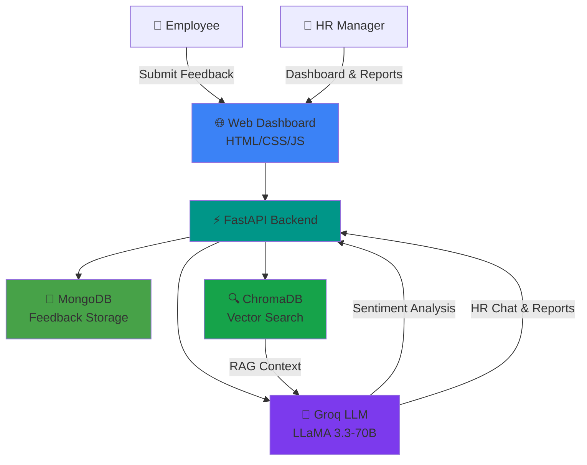

Live link: https://empfeedai-agent-fv3o.onrender.com

# Employee Feedback Agent

```
 ███████╗███████╗███████╗██████╗ ██████╗  █████╗  ██████╗██╗  ██╗
 ██╔════╝██╔════╝██╔════╝██╔══██╗██╔══██╗██╔══██╗██╔════╝██║ ██╔╝
 █████╗  █████╗  █████╗  ██████╔╝██████╔╝███████║██║     █████╔╝
 ██╔══╝  ██╔══╝  ██╔══╝  ██╔══██╗██╔══██╗██╔══██║██║     ██╔═██╗
 ███████╗██║     ███████╗██████╔╝██████╔╝██║  ██║╚██████╗██║  ██╗
 ╚══════╝╚═╝     ╚══════╝╚═════╝ ╚═════╝ ╚═╝  ╚═╝ ╚═════╝╚═╝  ╚═╝
        🤖 AI-Powered HR Feedback Collection & Analysis
```

**Autonomous · Sentiment-Aware · Action-Oriented**

[](https://python.org)
[](https://groq.com)
[](https://mongodb.com)
[](https://trychroma.com)
[](https://fastapi.tiangolo.com)
[](https://docker.com)

> **Employee Feedback Agent** is an AI-powered HR platform that collects, analyzes, and acts on employee feedback.
> Built with **Prompt Engineering**, **Groq LLM**, **MongoDB**, and **ChromaDB vector search** — delivering real-time sentiment analysis, semantic search, and executive HR reports through a modern web dashboard.

[📖 Documentation](./Documents) · [🚀 Quick Start](#-quick-start) · [🎯 Features](#-key-features) · [🏗️ Architecture](#️-system-architecture)

---

## 📑 Table of Contents

| Core Sections | Technical Deep Dives | Resources |
|:-------------:|:--------------------:|:---------:|
| [🎯 Key Features](#-key-features) | [🧠 Prompt Engineering](#-prompt-engineering) | [📖 Deployment Guide](./Documents/DEPLOYMENT.md) |
| [🏗️ System Architecture](#️-system-architecture) | [🗂️ RAG Pipeline](#️-vector-search-rag) | [⚙️ Configuration](#️-configuration) |
| [💬 Use Case Walkthrough](#-use-case-walkthrough) | [📊 API Reference](#-api-reference) | [👤 Author](#-author) |
| [🚀 Quick Start](#-quick-start) | [🐳 Docker Deployment](#-docker-deployment) | |

---

## 🎯 Key Features

| Feature | Description |
|:--------|:------------|
| 🤖 **AI Feedback Analysis** | Groq LLaMA 3.3-70B analyzes sentiment, themes, urgency, and action items |
| 📊 **HR Analytics Dashboard** | Real-time metrics: sentiment trends, department breakdown, category insights |
| 🔍 **Semantic Search (RAG)** | ChromaDB vector store enables natural-language feedback search |
| 💬 **HR Chat Agent** | Ask questions about employee sentiment with RAG-augmented LLM responses |
| 📋 **Executive Reports** | AI-generated HR reports with findings and prioritized recommendations |
| 🔒 **Anonymous Submissions** | Employees can submit feedback anonymously or identified |
| 🧠 **Prompt Engineering** | Role assignment, few-shot examples, chain-of-thought, JSON schema output |
| 🐳 **Production Ready** | Docker + Docker Compose with MongoDB for one-command deployment |

---

## 🏗️ System Architecture



### Tech Stack

| Layer | Technology |
|:------|:-----------|
| **Frontend** | HTML5, CSS3, JavaScript |
| **Backend** | Python 3.11, FastAPI, Uvicorn |
| **LLM** | Groq API (LLaMA 3.3-70B Versatile) |
| **Database** | MongoDB (document store) |
| **Vector DB** | ChromaDB + Sentence Transformers |
| **Deployment** | Docker, Docker Compose |

---

## 🧠 Prompt Engineering

This project applies core prompt engineering principles:

| Principle | Implementation |
|:----------|:---------------|
| **Role Assignment** | System prompts define HR Analyst, Chat Agent, and Report Writer personas |
| **Few-Shot Learning** | Feedback analysis includes 2 example input/output pairs |
| **Chain-of-Thought** | Step-by-step analysis instructions before JSON output |
| **Structured Output** | JSON schema enforcement for sentiment, themes, urgency, actions |
| **RAG Augmentation** | HR chat prompts include retrieved feedback context |
| **Temperature Control** | Analysis: 0.2, Chat: 0.4, Reports: 0.5 for task-appropriate creativity |

See `app/llm/prompts.py` for full prompt templates.

---

## 🗂️ Vector Search (RAG)

1. Employee submits feedback → stored in MongoDB
2. Feedback text embedded via `all-MiniLM-L6-v2` → indexed in ChromaDB
3. HR searches or chats → semantic similarity retrieves relevant feedback
4. Retrieved context injected into LLM prompt for grounded answers

---

## 💬 Use Case Walkthrough

### Employee Flow
1. Open dashboard → **Submit Feedback** tab
2. Select department, write feedback, choose anonymous/identified
3. Click **Analyze & Submit** → AI returns sentiment, themes, urgency, action items

### HR Flow
1. **Dashboard** → view analytics, recent feedback, semantic search
2. **Ask the Agent** → "What are Engineering's main concerns?"
3. **Generate Report** → executive summary with recommendations

---

## 🚀 Quick Start

### Prerequisites
- Python 3.11+
- MongoDB (local or Docker)
- Groq API key ([free at console.groq.com](https://console.groq.com))

### Local Development

```bash
# 1. Clone and setup
cd Employee_FeedBack_Agent
python -m venv .venv

# Windows
.venv\Scripts\activate

# 2. Install dependencies
pip install -r requirements.txt

# 3. Configure environment
copy .env.example .env
# Edit .env → set GROQ_API_KEY

# 4. Start MongoDB (if not running)
docker run -d -p 27017:27017 --name mongodb mongo:7

# 5. Run the app
python run.py

# 6. Seed sample data (optional)
python scripts/seed_data.py

# 7. Open browser
# http://localhost:8000
```

---

## 🐳 Docker Deployment

```bash
# Copy env and add Groq API key
cp .env.example .env

# Start everything (app + MongoDB)
docker-compose up --build -d

# Seed demo data
docker-compose exec app python scripts/seed_data.py

# Access at http://localhost:8000
```

See [Documents/DEPLOYMENT.md](./Documents/DEPLOYMENT.md) for Railway, Render, and AWS deployment.

---

## 📊 API Reference

| Method | Endpoint | Description |
|:-------|:---------|:------------|
| `GET` | `/api/status` | Health check + analytics summary |
| `POST` | `/api/feedback` | Submit and analyze feedback |
| `GET` | `/api/feedback` | List feedback (filter by dept/sentiment) |
| `GET` | `/api/feedback/search?q=` | Semantic vector search |
| `GET` | `/api/analytics` | Dashboard analytics |
| `POST` | `/api/chat` | HR chat with AI agent |
| `GET` | `/api/report` | Generate executive HR report |

### Example: Submit Feedback

```bash
curl -X POST http://localhost:8000/api/feedback \
  -H "Content-Type: application/json" \
  -d '{
    "feedback_text": "Great team culture but onboarding needs improvement.",
    "department": "Engineering",
    "is_anonymous": true
  }'
```

---

## ⚙️ Configuration

| Variable | Default | Description |
|:---------|:--------|:------------|
| `GROQ_API_KEY` | — | Groq API key (required for AI features) |
| `GROQ_MODEL` | `llama-3.3-70b-versatile` | LLM model name |
| `MONGODB_URI` | `mongodb://localhost:27017` | MongoDB connection string |
| `MONGODB_DB` | `employee_feedback` | Database name |
| `CHROMA_PERSIST_DIR` | `./chroma_store` | ChromaDB storage path |
| `APP_PORT` | `8000` | Server port |

---

## 📁 Project Structure

```
Employee_FeedBack_Agent/
├── app/
│   ├── main.py              # FastAPI entry point
│   ├── config.py            # Environment settings
│   ├── db/
│   │   ├── mongodb.py       # MongoDB operations
│   │   └── chroma.py        # ChromaDB vector store
│   ├── llm/
│   │   ├── client.py        # Groq LLM client
│   │   └── prompts.py       # Prompt engineering templates
│   ├── services/
│   │   ├── feedback_service.py
│   │   └── analytics_service.py
│   └── routes/
│       └── api.py           # REST API endpoints
├── frontend/static/
│   ├── index.html           # Dashboard UI
│   ├── css/style.css
│   └── js/app.js
├── Documents/
│   └── DEPLOYMENT.md
├── scripts/
│   └── seed_data.py
├── Dockerfile
├── docker-compose.yml
├── requirements.txt
└── README.md
```

---

## ✅ Requirements Checklist

| Requirement | Status | Implementation |
|:------------|:------:|:---------------|
| Individual project (unique topic) | ✅ | Employee Feedback Agent — HR use case |
| Programming language | ✅ | Python 3.11 |
| Prompt Engineering | ✅ | Role, few-shot, CoT, JSON schema (`app/llm/prompts.py`) |
| LLM API (Gemini/Groq) | ✅ | Groq API — LLaMA 3.3-70B |
| Database | ✅ | MongoDB + ChromaDB Vector DB |
| Web Framework | ✅ | FastAPI |
| Frontend (HTML/CSS/JS) | ✅ | Modern responsive dashboard |
| Deployment (AWS/Azure/Docker) | ✅ | Docker + Docker Compose |

---

## 👤 Author

**Employee Feedback Agent** — Individual AI Project  
Use Case: HR — Collects and analyzes employee feedback using AI

---

## 📄 License

MIT License — free to use for educational and demonstration purposes.
